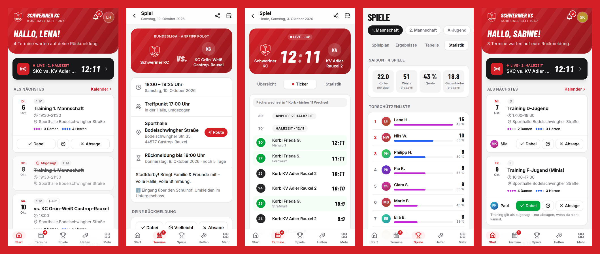

# SKC-App – die Vereins-App des Schweriner KC

Die App für den **Schweriner Korfball Club e. V. '67**: Trainings und Spiele zu- und absagen, Live-Ticker, Statistiken bis auf jede Spielerin und jeden Spieler, Helferlisten, Fahrgemeinschaften, News mit Umfragen und Specials – auf jedem Handy, ohne App-Store.



> **Ausprobieren:** `npm install && npm run dev` öffnen und unten eine **Demo-Rolle** wählen (Spielerin, Trainer, Elternteil, Vorstand). Im Demo-Modus liegen alle Daten nur im Browser.

---

## Was die App kann

| Bereich | Funktionen |
| --- | --- |
| **Start** | Persönlicher Überblick: nächste Termine mit **Ein-Tipp-Zusage**, offene Rückmeldungen, laufende Live-Spiele, letztes Ergebnis, Helferaufrufe, News, Specials |
| **Termine** | Trainings, Spiele, Vereinstermine · Filter nach Art und Team · Zusage / Vielleicht / Absage mit Grund (nur für Trainer:innen sichtbar) · Rückmeldefrist mit Countdown · Route zur Halle · Export in den eigenen Kalender (iPhone, Google, Outlook) |
| **Korfball-spezifisch** | **4+4-Anzeige**: wie viele Damen und Herren zugesagt haben und wer für eine vollständige Aufstellung fehlt · **Fächerwechsel**-Hinweis nach je zwei Körben · Statistik nach **Wurfart** (Fernwurf, Nahwurf, Durchlaufball, Strafwurf, Freiwurf) |
| **Spiele** | Spielplan, Ergebnisse mit Formkurve, Tabelle, Saison-Statistik, Torschützenliste, Trainingsbeteiligung |
| **Live-Ticker** | Trainer:innen erfassen Körbe und Fehlwürfe pro Spieler:in direkt am Spielfeldrand (Spieluhr, Halbzeit, Rückgängig, Bildschirm bleibt an). Alle anderen sehen den Spielstand live. Statistiken entstehen daraus automatisch. |
| **Ergebnis-Grafik** | Nach dem Spiel eine fertige Instagram-Grafik (1080×1350) mit Ergebnis und Torschütz:innen erzeugen und teilen |
| **Kader** | Trainer:innen nominieren den Kader (mit Damen/Herren-Zählung), Nominierte werden benachrichtigt |
| **Erinnern** | Ein Knopf erinnert alle, die noch nicht geantwortet haben (inkl. Eltern) |
| **Abwesenheiten** | Urlaub, Verletzung, Klassenfahrt einmal eintragen → automatisch für alle Termine im Zeitraum abgemeldet |
| **Eltern** | Eltern sagen für ihre Kinder zu/ab, melden sie für Fahrgemeinschaften an und bekommen deren Benachrichtigungen |
| **Fahrgemeinschaften** | Fahrt anbieten (Plätze, Treffpunkt, Abfahrt), mitfahren, aussteigen – bei Auswärtsspielen und Vereinsevents |
| **Helferlisten** | Schichten mit Plätzen (Aufbau, Kampfgericht, Kuchen, Kasse …), „Ich helfe“ mit einem Tipp, „Meine Einsätze“, Fortschrittsbalken |
| **News & Umfragen** | Beiträge vom Vorstand und Trainerteam, Reaktionen, Umfragen (Einfach- oder Mehrfachauswahl) |
| **Specials** | Fanshop, Partner-Angebote mit Rabattcodes (nur für Mitglieder), Vereinsaktionen |
| **Teams & Hallen** | Trainingszeiten, Trainerteam, Kader, Hallen mit Route |
| **Benachrichtigungen** | In der App und als **Push aufs Handy** – pro Art abschaltbar |
| **Zugang** | Anmeldung per **6-stelligem E-Mail-Code** (kein Passwort nötig, funktioniert auch in der installierten App auf dem iPhone) · Gastzugang für Spielplan & Ergebnisse · „Zugang anfragen“ mit Freischaltung durch den Vorstand |
| **Sonstiges** | Installierbar als App (PWA), offline nutzbar, Dark Mode, Tablet-Ansicht mit Seitenleiste, Datenschutz: keine Werbung, kein Tracking, Daten in der EU |

### Rollen & Rechte

| Rolle | Darf |
| --- | --- |
| Gast | Öffentliche Termine, Spielplan, Ergebnisse, Tabellen, öffentliche News |
| Spieler:in | Zu-/absagen, Abwesenheiten, Helferschichten, Fahrgemeinschaften, Umfragen, Statistiken |
| Elternteil | Wie Spieler:in – zusätzlich für die eigenen Kinder |
| Trainer:in | Termine & Spiele des eigenen Teams anlegen/ändern/absagen, Kader nominieren, Live-Ticker, Absagegründe und Telefonnummern des eigenen Teams sehen, Team-News |
| Vorstand | Alles, inkl. Vereinstermine, Helferlisten, News, Zugänge freischalten |

Die Rechte werden **in der Datenbank** durchgesetzt (Row Level Security), nicht nur in der Oberfläche.

---

## Technik

- **App:** React 19 + TypeScript, Vite, Tailwind CSS, TanStack Query, als **PWA** installierbar (Service Worker, offline, Push)
- **Backend:** [Supabase](https://supabase.com) (Postgres, Auth, Realtime, Edge Functions) – Region **Frankfurt** empfohlen (DSGVO)
- **Demo-Modus:** Ohne Supabase-Zugangsdaten läuft die App mit realistischen Beispieldaten komplett im Browser

```
src/
  config/club.ts          Vereinsdaten (Name, Adresse, Shop-Link …)
  data/                   Datenmodell und Schnittstelle (api.ts)
    demo/                 Demo-Datenquelle + Beispieldaten
    supabase/             Produktions-Datenquelle
  lib/                    Logik: Zusagen/Abwesenheiten, Korfball, Statistik, Rechte, Kalender-Export, Push
  screens/                Bildschirme
  components/             UI-Bausteine
supabase/
  migrations/             Datenbankschema, Rechte, Funktionen
  functions/send-push/    Edge Function für Push-Benachrichtigungen
  seed.sql                Startdaten (Teams, Hallen, Fanshop)
  tests/                  Datenbank- und Integrationstests
```

### Tests

| Befehl | Prüft |
| --- | --- |
| `npm test` | Logik: Zusagen, Abwesenheiten, 4+4, Fächerwechsel, Statistik, Rechte, Kalender-Export |
| `npm run test:db` | Datenbank auf frischem Postgres: 60+ Prüfungen zu Rechten, maskierten Daten, Funktionen und Benachrichtigungen |
| `npm run test:api` | Der echte Supabase-Adapter gegen Postgres + PostgREST (dieselbe REST-Schicht wie Supabase) für alle Rollen |
| `npm run test:e2e` | Klickt die wichtigsten Abläufe im Browser durch (Zusage, Absage, Live-Erfassung, Helfen, Freischalten …) |

Alle Tests laufen automatisch bei jedem Push (GitHub Actions).

---

## Livegang – Schritt für Schritt

1. **Supabase-Projekt anlegen** auf [supabase.com](https://supabase.com) (kostenloser Plan reicht), Region *Central EU (Frankfurt)*.
2. **Datenbank einrichten:** Im SQL-Editor nacheinander die Dateien aus `supabase/migrations/` ausführen, danach `supabase/seed.sql` (vorher Teams/Hallen anpassen). Alternativ mit der Supabase CLI: `supabase link` und `supabase db push`.
3. **Anmeldung per Code einstellen:** *Authentication → Email Templates* – in den Vorlagen „Magic Link“ und „Confirm signup“ den Code einfügen, z. B.
   `Dein Anmeldecode für die SKC-App: {{ .Token }}`.
   Unter *Authentication → URL Configuration* die Adresse der App als Site URL eintragen. Für viele Mitglieder einen eigenen SMTP-Server hinterlegen (*Project Settings → Auth → SMTP*).
4. **Vorstand anlegen:** In der Tabelle `members` eine Zeile mit E-Mail und `roles = {board,admin}` anlegen. Wer sich mit dieser E-Mail anmeldet, wird automatisch verknüpft. Danach geht alles Weitere in der App (Zugangsanfragen freischalten). Teams, Trainer:innen (`team_coaches`) und Eltern (`guardians`) lassen sich im Table Editor pflegen.
5. **App verbinden:** `.env.example` nach `.env` kopieren und `VITE_SUPABASE_URL` sowie `VITE_SUPABASE_ANON_KEY` (*Project Settings → API*) eintragen.
6. **Veröffentlichen:**
   - **GitHub Pages:** *Settings → Pages → Source: GitHub Actions*. Die Werte aus Schritt 5 als Repository-Variablen (*Settings → Secrets and variables → Actions → Variables*) hinterlegen. Jeder Push auf `main` veröffentlicht die App.
   - Alternativ jeder statische Hoster (Netlify, Vercel, eigener Webspace): `npm run build` und den Ordner `dist/` hochladen. Eine eigene Domain wie `app.schwerinerkc.de` ist möglich.
7. **Push-Benachrichtigungen (optional):**
   - Schlüssel erzeugen: `npx web-push generate-vapid-keys`
   - Edge Function deployen: `supabase functions deploy send-push --no-verify-jwt`
   - Secrets setzen: `supabase secrets set VAPID_PUBLIC_KEY=… VAPID_PRIVATE_KEY=… VAPID_CONTACT=mailto:vorstand@schwerinerkc.de PUSH_WEBHOOK_SECRET=<langes Zufallswort>`
   - *Database → Webhooks*: bei `INSERT` auf `notifications` die Funktion `send-push` aufrufen, Header `Authorization: Bearer <PUSH_WEBHOOK_SECRET>`
   - `VITE_VAPID_PUBLIC_KEY` in der App-Konfiguration ergänzen
8. **Mitglieder einladen:** Link zur App teilen. Auf dem iPhone in Safari *Teilen → Zum Home-Bildschirm*, auf Android *App installieren*.

### Vor dem Livegang anpassen

- `public/logo.svg` durch das echte Vereinswappen ersetzen (Platzhalter: rotes SKC-Wappen) und die App-Icons neu erzeugen: `node scripts/render-svg.mjs public/logo.svg public/icon-512.png 512 '#ffffff' 40` (analog für 192, Maskable und Apple-Touch-Icon)
- Vereinsdaten in `src/config/club.ts` prüfen
- Datenschutzerklärung (`src/screens/ClubInfo.tsx`) vom Vorstand prüfen lassen
- Halbzeitlänge, Ligen und Tabellen je Team pflegen (`leagues`, `league_rows`)

---

## Ideen für danach

- Tabellen und Spielpläne automatisch von korfball.de übernehmen
- Mannschaftskasse / Strafenkatalog
- Mitgliedsbeiträge und Dokumente (Satzung, Hallenordnung)
- Chat pro Team
- Wrapper für App Store / Play Store (Capacitor), falls gewünscht
